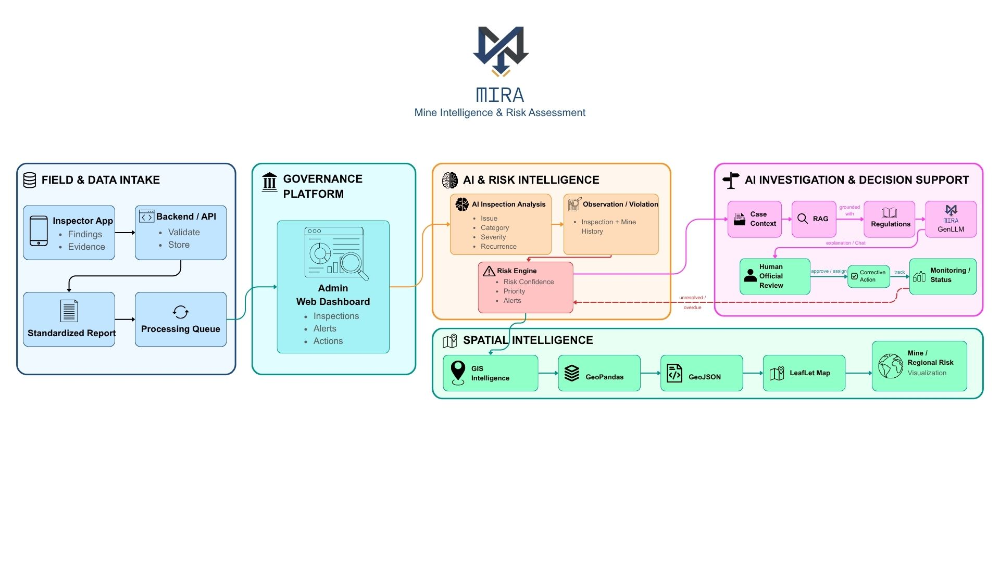

<div align="center">


<p align="center">
  
  
  
  
  
  
  
  
</p>

> **MIRA — Mine Intelligence & Risk Assessment** is an AI-powered smart governance and compliance monitoring platform for coal mines. It analyzes inspection findings, classifies safety issues, predicts risk levels, retrieves relevant mining regulations using RAG, and generates evidence-grounded AI insights.

<p align="center">
  
  
  
</p>

🚨 **From inspection observations to intelligent, evidence-grounded compliance decisions.**

</div>

---

# ⛏️ Project Overview

**MIRA** is an AI-based governance and compliance monitoring system designed for the **coal mining sector**.

The platform transforms raw inspection observations into structured intelligence using a combination of:

* 🧠 **Fine-tuned DistilBERT** for finding classification
* ⚠️ **Multi-class Logistic Regression** for risk prediction
* 📚 **DPR + FAISS** for regulatory retrieval
* 🤖 **Custom-prompted Qwen2.5-3B-Instruct** for AI investigation
* 🗄️ **MariaDB** for inspection and compliance data
* 🗺️ **Interactive risk visualization** for mine-level monitoring

The goal is to help stakeholders move from **manual and reactive compliance monitoring** toward **AI-assisted, proactive risk assessment**.

---

# ⚠️ Problem Context

Coal mine inspections generate large amounts of safety and compliance information.

Traditional workflows can make it difficult to:

* Analyze large numbers of findings efficiently
* Prioritize high-risk observations
* Connect findings with applicable regulations
* Search through lengthy government regulations
* Convert inspection data into actionable intelligence
* Identify recurring safety issues early

MIRA addresses these challenges through an integrated AI pipeline.

---

# 💡 The Solution

```text
Inspection Report
       │
       ▼
Finding Extraction
       │
       ▼
AI Finding Classification
       │
       ├── Issue
       ├── Category
       ├── Severity
       └── Recurrence
       │
       ▼
Risk Engine
       │
       ├── Risk Level
       ├── Risk Score
       └── Confidence
       │
       ▼
Risk Monitoring
       │
       ▼
User Investigation Query
       │
       ▼
RAG Retrieval
       │
       ├── DPR Question Encoder
       ├── FAISS Vector Search
       └── Regulatory Knowledge Base
       │
       ▼
Context Assembly
       │
       ├── Inspection Findings
       ├── Risk Results
       └── Regulatory Guidance
       │
       ▼
Qwen2.5-3B-Instruct
       │
       ▼
AI Compliance Response
```

---

# 🔄 Core Workflow

### 📋 Inspection Analysis

Inspection reports are processed to extract individual findings and their associated information.

↓

### 🧠 AI Classification

Fine-tuned **DistilBERT** analyzes each finding and predicts:

* Issue
* Category
* Severity
* Recurrence

↓

### ⚠️ Risk Assessment

The classification outputs are transformed into features and passed to a **multi-class Logistic Regression Risk Engine**.

↓

### 📚 Regulatory Retrieval

When an inspector asks a question, MIRA retrieves the most relevant regulatory passages using:

**DPR → FAISS → Regulatory Chunks**

↓

### 🤖 AI Investigation

The retrieved regulatory guidance, inspection findings, and risk information are provided to **Qwen2.5-3B-Instruct** through custom prompts.

↓

### 💬 Grounded Response

The system generates a contextual response based on the inspection and retrieved regulatory evidence.

---

# 🧠 AI Intelligence

## 🔹 1. Finding Classification — DistilBERT

MIRA uses a fine-tuned **DistilBERT** model for multi-task inspection finding classification.

Each finding is analyzed across four dimensions:

| Prediction | Purpose                                         |
| ---------- | ----------------------------------------------- |
| Issue      | Identifies the specific safety/compliance issue |
| Category   | Groups the finding into a broader domain        |
| Severity   | Determines Critical / High / Medium / Low       |
| Recurrence | Identifies recurring observations               |

### Supported Issue Types

* Dust Suppression
* Electrical Safety
* Emergency Preparedness
* Equipment Maintenance
* Fire Safety
* Haul Road
* PPE
* Roof Support
* Ventilation
* Water Drainage

---

# ⚠️ 2. Risk Engine

The classified findings are passed to a **multi-class Logistic Regression model**.

```text
DistilBERT Outputs
       │
       ▼
Feature Encoding
       │
       ▼
Multi-Class Logistic Regression
       │
       ▼
Risk Prediction
```

The Risk Engine provides:

* Risk level
* Risk score
* Confidence
* Risk prioritization

This allows inspections to be analyzed according to the potential severity of their safety and compliance risks.

---

# 📚 3. Regulatory Intelligence — RAG

MIRA uses **Retrieval-Augmented Generation** to connect inspection findings with relevant regulatory guidance.

The regulatory knowledge base is processed **offline**.

```text
Government Regulations
        │
        ▼
Text Extraction
        │
        ▼
Regulatory Chunking
        │
        ▼
DPR Context Encoder
        │
        ▼
Embeddings
        │
        ▼
FAISS Index
```

The generated artifacts are stored as:

```text
regulatory.index
regulatory_chunks.pkl
```

These artifacts are loaded by the backend at runtime.

### Runtime Retrieval

```text
User Question
      │
      ▼
DPR Question Encoder
      │
      ▼
Query Embedding
      │
      ▼
Saved FAISS Index
      │
      ▼
Top-K Relevant Chunks
      │
      ▼
Regulatory Guidance
```

This avoids re-encoding the entire regulatory document for every question.

---

# 🤖 4. Generative AI — Qwen2.5-3B

MIRA uses **Qwen2.5-3B-Instruct** as its Generative AI layer.

The model receives a structured prompt containing:

```text
User Query
+
Inspection Findings
+
Classification Results
+
Risk Information
+
Retrieved Regulatory Guidance
```

The model then generates a contextual compliance response.

### Customization

The GenLLM layer uses:

* Custom prompting
* Instruction-oriented formatting
* LoRA-based fine-tuning
* English and Hinglish interaction support

---

# 🗺️ Risk Visualization

MIRA provides geographical visualization for mine-level monitoring.

The platform uses:

* **GeoPandas**
* **Leaflet**
* Risk-based geographical visualization
* Interactive mine/region information

Users can explore mining regions and identify areas associated with higher risk.

---

# 💬 AI Investigation Assistant

The integrated chatbot allows users to investigate inspection findings using natural language.

Example:

> **Which findings are the most serious and why should they be prioritized?**

The system combines:

```text
User Question
+
Inspection Context
+
Risk Analysis
+
Regulatory Guidance
```

to generate an AI-assisted investigation response.

---

# 📊 Key Features

### 🧠 AI Finding Classification

Automatically classifies inspection observations using fine-tuned DistilBERT.

### ⚠️ Risk Prediction

Predicts risk using a multi-class Logistic Regression Risk Engine.

### 📚 Regulatory RAG

Retrieves relevant sections from mining regulations using DPR and FAISS.

### 🤖 Generative AI

Uses Qwen2.5-3B-Instruct to generate contextual compliance insights.

### 💬 AI Investigation

Allows natural-language investigation of inspection findings.

### 🗺️ Risk Mapping

Visualizes mine-level risk information geographically.

### 🔁 Recurrence Detection

Identifies recurring safety and compliance findings.

### 🌐 Multilingual Interaction

Supports English and Hinglish user interaction.

### 🔎 Evidence-Grounded Responses

Uses retrieved regulatory guidance as context for AI-generated responses.

---

# 🏗️ System Architecture

<p align="center">
  
</p>

---

# 🧩 Tech Stack

| Layer                      | Technologies                                     |
| -------------------------- | ------------------------------------------------ |
| 🖥️ **Frontend**           | HTML5 · CSS3 · JavaScript · Tailwind CSS         |
| 🌐 **Backend**             | Python · Flask · REST APIs                       |
| 🗄️ **Database**           | MariaDB · SQL                                    |
| 🧠 **AI / NLP**            | PyTorch · Hugging Face Transformers · DistilBERT |
| ⚠️ **Risk Engine**         | Scikit-learn · Multi-class Logistic Regression   |
| 🤖 **Generative AI**       | Qwen2.5-3B-Instruct · LoRA · Custom Prompting    |
| 📚 **RAG**                 | DPR · FAISS · Vector Embeddings                  |
| 🗺️ **Geospatial**         | GeoPandas · GeoJSON · Leaflet                    |
| 📊 **Visualization**       | Chart.js · Matplotlib                            |
| 📄 **Document Processing** | PyMuPDF (fitz) · PDF Text Extraction             |
| 🛠️ **Development**        | Git · GitHub · Jupyter Notebook · VS Code        |


---

# 📂 Project Structure

```text
MIRA---Mine-Intelligence-and-Risk-Assessment/
│
├── app.py
├── load_model.py
├── requirements.txt
├── README.md
│
├── models/
│   ├── MIRA DistilBERT
│   ├── Risk Classifier
│   └── Qwen LoRA
│
├── data/
│   └── Encodings/
│       ├── regulatory.index
│       └── regulatory_chunks.pkl
│
├── templates/
│   ├── dashboard.html
│   ├── chatbot.html
│   └── ...
│
├── static/
│   ├── css/
│   ├── js/
│   └── ...
│
├── Knowledge Bases/
│
└── Notebooks/
    ├── Model Training
    ├── RAG Pipeline
    └── GenLLM
```

---

# ⚙️ Installation

### 1️⃣ Clone the Repository

```bash
git clone https://github.com/TanmayKhomane13/MIRA---Mine-Intelligence-and-Risk-Assessment.git

cd MIRA---Mine-Intelligence-and-Risk-Assessment
```

### 2️⃣ Create Virtual Environment

```bash
python -m venv team_venv
```

Activate:

```bash
source team_venv/bin/activate
```

### 3️⃣ Install Dependencies

```bash
pip install -r requirements.txt
```

### 4️⃣ Configure Database

Configure the MariaDB database and required environment variables.

### 5️⃣ Configure Model & RAG Paths

Ensure the trained models and RAG artifacts are available.

Required RAG artifacts:

```text
regulatory.index
regulatory_chunks.pkl
```

---

# ▶️ Running the Application

Start Flask:

```bash
flask run
```

or:

```bash
python app.py
```

Open the application in your browser.

---

# 🔐 Model & Data Artifacts

Large trained model files and sensitive/local database artifacts may not be included in the repository.

Before running the complete application, ensure the required model files and RAG artifacts are available at their configured paths.

---

# 🎯 Vision

<div align="center">

### From Inspection Data → Risk Intelligence → Regulatory Guidance → Actionable Decisions

**MIRA aims to make coal mine governance more proactive, intelligent, and evidence-driven.**

</div>

---

<div align="center">

## ⛏️ Mine Safer. Govern Smarter. Act Earlier.

---

### 📜 Copyright

© 2026 **Tanmay Khomane, Kaustubh Bag**

All rights reserved.

</div>
